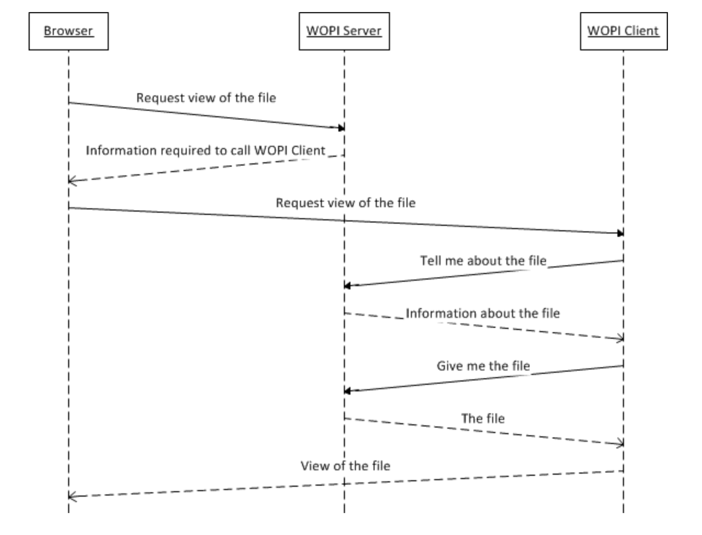

### HOST PAGE

- Here in index.ejs we render list of files/documemts from source.
- We POST values like `access token`,` access_token_ttl`, `user_id` and `owner_id` to the iframe using `form` element.
  - `access token`: An access token that the host will use to determine the identity and permissions of the issuer of a WOPI request.
  - `access_token_ttl`: The time when an access token expires, represented as the number of milliseconds since January 1, 1970 UTC.
- Depending on the type of file i.e docx or xlsx, this iframe element is pointed to its respective WOPI action url.

##### WOPI discovery URLs

- Production: https://onenote.officeapps.live.com/hosting/discovery
- Test/Dogfood: https://ffc-onenote.officeapps.live.com/hosting/discovery

### WOPI REST Endpoints:

- our wopi server has four endpoints

1. POST /wopi/files/:fileId:

- Here, we `lock` the file for editing by WOPI client application instances that requested the lock.
- WOPI clients usually make a Lock request to lock a file prior to calling POST /wopi/files/(file_id)/contents.

2. GET /wopi/files/:fileId:

- The `CheckFileInfo` operation returns information about a file, a user's permissions on that file, and general information about the capabilities that the WOPI host has on the file.

3. GET /wopi/files/:file_id/contents

- The `GetFile` operation retrieves a file from a host.

4. POST /wopi/files/:file_id/contents

- The `PutFile` operation updates a file’s binary contents.

There are two envs in .env

1. ACCOUNT_NAME
2. SAS_TOKEN
